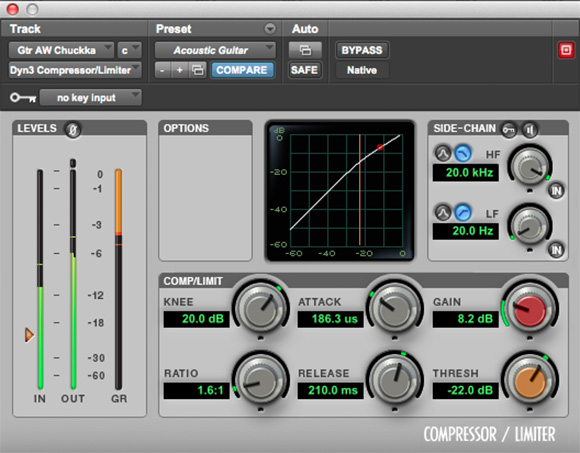
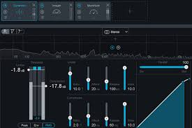
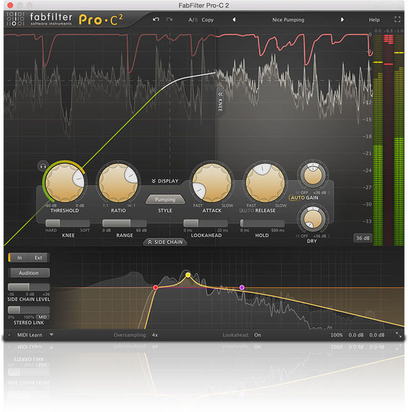
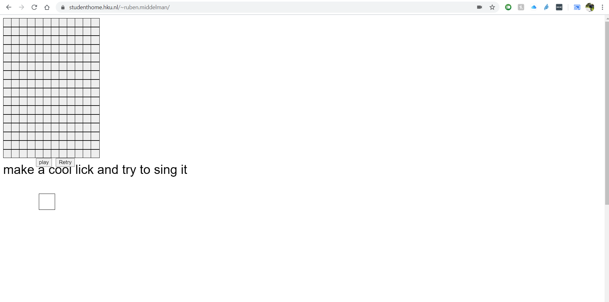
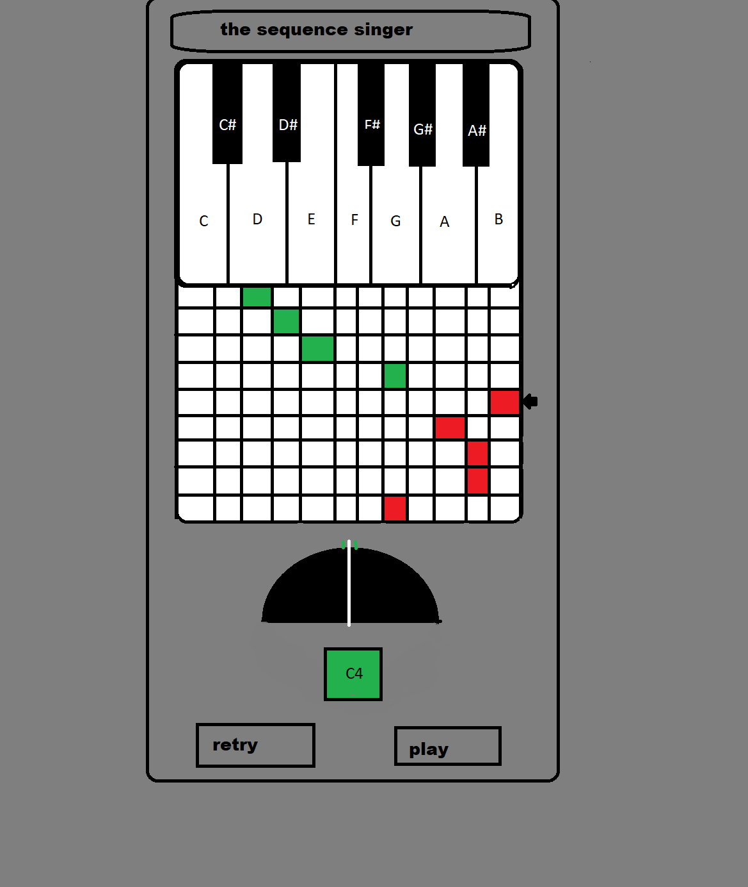
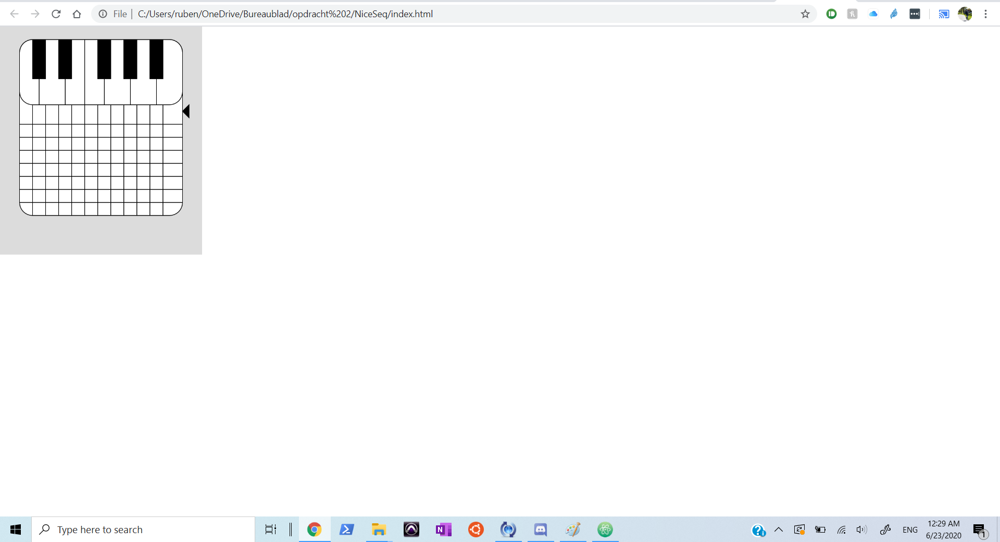
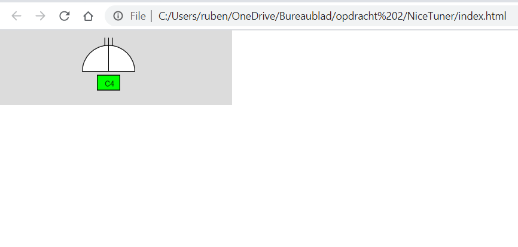

# CSD herkansingen
in de folder C++ vindt u een werkende mooie versie van inheritance met een synth class.
hieronder gaan we door met een onderzoek naar hoe een GUI nou ontworpen word
ik hoop dat u er wat van leert.

# CSD Onderzoek naar een goede GUI

Voor mijn CSD opdracht 3 heb ik besloten om een onderzoek te doen naar een soort plugin die alle mix engineers gebruiken. Ik wil graag kijken naar compressoren en hoe het zit met verschillende soorten. Ik heb een paar dingen opgesteld die ik graag wil onderzoek.
Ik vind beginner vriendelijkheid erg belangrijk. Kan iemand die niet zo veel mixt of net begint met mixen werken met deze plugin. Ook vind ik het belangrijk om te onderzoeken hoe de GUI beïnvloed wat de gebruiker doet. Dus als ik nummertjes neerzet verwachten de meeste mensen dat ze iets in volgorden doen. Maar doen mensen dingen ook in volgorden als er geen nummertjes bij staan.
Ik wil ook kijken of de plugin behulpzaam is. Ik merk namelijk dat er wat compressoren zijn die je in het diepe gooien en dan zijn van zoek het maar uit terwijl er ook compressoren zijn die je helpen met hoe je de instellingen het best kan instellen.
Maakt het aantal parameters nog uit. Ik ken compressoren die een heleboel kunnen maar misschien is het veel fijner om een GUI van een compressor te hebben die veel simpeler is. Ik wil daarom naar de verschillen kijken die veel tegen weinig parameters oproepen.
Ik heb voor mijn onderzoek 4 verschillende compressoren gekozen die ook allemaal op verschillende prijs punten zijn. Dit zijn:
1. De pro tools standaard
2. De izotope ozone 8
3. De fabfilter Pro-C 2
Ik heb deze compressoren gekozen omdat het 3 verschillende compressoren zijn op 3 totaal verschillende prijzen. Ik kreeg de pro tools standaard compressor bij mijn pro tools dus we zeggen dat die gratis was. Dan heb ik de izotope ozone 8 in een pack gekocht voor 50 euro. En dan als duurste de fabfilter compressor voor 150 euro. Dat is een stuk meer geld dan de rest en we zullen kijken of dit ook te zien is in de GUI.

Ik zal het nog even voor de zekerheid zeggen. Ik test de plugins hier niet op geluid! Ik ben letterlijk alleen maar naar de GUI’s aan het kijken.

Nou laten we dan beginnen.

## De pro tools standaard compressor 

Deze plugin zal voor de meeste beginners een van de eerste plugins zijn die ze moeten leren gebruiken. Daarom vind ik het heel erg belangrijk om bij deze plugin nog even extra te kijken naar of deze GUI geschikt is voor beginners.

Wat werkt er goed?

Ik vind dat deze compressor goed werkt als basis compressor. Hij geeft niet te veel opties dat je overspoelt raakt door mogelijkheden maar hij geeft wel genoeg om een mooi geluid te maken. Voor de rest ben ik tevreden over de manier hoe de compressie visueel wordt laten zien. Ik denk alleen dat ik dit visueel wel snap maar mensen die net begonnen zijn met het gebruiken van een compressor zullen dit misschien niet snappen (maar dan moet er wel in het achterhoofd gehouden worden dat compressie zowiezo moeilijk is om te laten zien)
Ook vind ik de kleurcodering erg fijn. Je kan zien dat alles met oranje te maken heeft met de threshold

Wat kan beter?

Ik denk dat erg veel dingen beter kunnen. Als je bijvoorbeeld naar opties wil die best wel advanced zijn voor een compressor (ik neem hier bijvoorbeeld side-chain) dan vind ik dat de manier van hoe dat hier in deze plugin wordt laten zien niet echt goed. Het vakje waar je in moet klinken is erg klein en wordt snel over het hoofd gezien. Ook viel mij dit nu pas op maar er zit een vak OPTIONS in het scherm wat letterlijk totaal niks doet. Dit vak zou misschien gebruikt kunnen worden om de Side-Chain compressie vak te vergroten of nog wat visueels er bij te doen. Ook is een ding waar naar gekeken moet worden dat compressie op een stereo kanaal niet stereo wordt laten zien. Als je naar de zijkant kijkt zie je 2 audio balken in het groen maar een compressie balk dit is raar want compressie kan natuurlijk anders op het ene kanaal werken dan op het andere kanaal. Nog iets is dat ik altijd geleerd heb dat compressoren het best kunnen worden ingesteld in een bepaalde orde. Ik zal niet ingaan op dit soort theorieën maar wat mij bijvoorbeeld slim had geleken was om dit op een bepaalde orde te zetten want op dit moment voelt het een beetje alsof de instellingen gewoon zijn neergeklapt.

Ziet het er mooi en constant uit?

Constant = ja, het ziet er erg constant uit. De knoppen zijn erg hetzelfde en gaan goed met de pro tools vibe. 
Mooi = nee, ik vind dat deze layout er niet perse mooi uitziet. Het is een beetje alsof er meer is gericht op de werking dan de GUI. Ik kan het daar op sommige niveaus wel mee eens zijn maar er kan hier echt wel wat meer tijd in deze layout gestoken worden. Kijk bijvoorbeeld naar hoe de nummers er uit zien. Zoiets ziet er precies uit als een preset van een GUI maak library en dat hoeft zeker niet altijd een probleem te zijn maar wel als je de industriestandaard bent.

Hoe is deze plugin gemaakt denk je?

Als ik kijk naar deze plugin dan zie ik. Oké we hebben een DAW gemaakt, daar moeten nog wat plugins in laten we snel een GUI maken voor een standaard plugin.”  Het ding wat mij het meest intrigeert aan deze plugin is de manier waarop Compressie met basis van threshold wordt laten zien. Als je er namelijk even naar kijkt dan zie je precies hoe het werkt. Totdat je de compressor over zijn nek laat gaan en dan begint het balletje wat rond beweegt ineens raar rond te bewegen. Dit is niet een geweldige descriptie maar dat is wel wat er gebeurt. Daarom vind ik dat dus niet helemaal mooi. Maar de manier van hoe een Knee wordt laten zien is voor een beginneling wel erg slim want dat zie je direct als je het aanpast en dat is voor een beginner erg belangrijk.

Is deze plugin beginner vriendelijk?

Zoals ik al zei op sommige manieren is deze plugin vriendelijk voor een beginner. Compressie is een van de moeilijkste dingen om te horen als beginner dus het is erg belangrijk dat je een visueel iets hebt om te zien wat je nou aan het doen bent. Ik vind daarom wel dat de visuele manier van de pro tools standaard erg helpt. Daarintegen is de manier van advanced opties gebruiken een stuk lastiger en dat zal voor een beginner echt niet fijn zijn om te gebruiken.

Is deze plugin behulpzaam?

Ik vind dat dit een plugin is die je een beetje in het diepe gooit. De enige manier om te leren hoe je dit gebruikt is om online te kijken hoe je met een compressor omgaat. De plugin zelf geeft totaal geen info. Ik snap natuurlijk dat dit is doordat deze plugin natuurlijk niet alleen gebruikt wordt door beginners maar ook door professionals. Maar nog steeds helpt de plugin niet met het instellen van de plugin.

Maakt het aantal parameters nog uit?

Ik vind dat de belangrijke parameters genoeg highlights krijgen maar advanced opties dat zeker niet krijgen terwijl daar wel ruimte voor is. Voor mijn gevoel is dit zeker voor een beginner het perfecte aantal parameters en genoeg voor een professional.  

## Izotope ozone 8

Izotope ozone 8 is origineel een mastering plugin die ook nog een EQ en een stereo imager. Maar voor dit onderzoek ga ik focussen op de compressor omdat ik dit op zich een fijne compressor vindt om op een master te doen. Ik vind niet dat dit een EQ is die veel beginners zullen gebruiken dus zal ik niet specifiek kijken naar of dit een goede plugin is om te gebruiken voor beginners.

Wat werkt er goed?

Ik vind hoe deze plugin de compressie weergeeft erg fijn. Het laat aan beide links en rechts zien dat er op beide kanalen compressie gebeurd die niet precies hetzelfde is. Dit doet de pro tools compressor niet wat ik niet fijn vindt. Wat ik ook fijn vindt is het design van de plugin. Het ziet er allemaal slik uit en het werkt allemaal mooi. Er zijn wat advanced opties maar omdat het voor mastering is bedoeld is het niet nodig om een side-chain functie te hebben. Dit is waarom ik het ook een mooi design vindt. Het doet niet allemaal extra dingen die onnodig zijn.

Wat kan beter?

Ik zie dat er is nagedacht over hoe alles in elkaar is gezet. Ik ben het niet helemaal eens over de volgorde ik denk dat dat misschien wat anders kan maar hé dat is niet het grootste probleem hier. Wat ik ook niet zo fijn vindt is dat het sliders zijn en niet dials. Een slider geeft echt het gevoel van een dak terwijl ik vindt dat een compressor niet een echt dak hoort te hebben. Ja er zit ook een eindpunt aan een dial maar dat voelt niet zo erg als een dak als een slider doet. Dit zou ik veranderen. Ook kan de slider bij de audiometer soms erg ingewikkeld worden en daardoor kan je een beetje kwijt raken wat je aan het doen bent.  Ook is de manier met de grid soms een beetje complex omdat er geen nummers bij staan en ik denk dat de meeste mensen die een compressor gebruiken het wel erg fijn vinden om te zien aan nummers wat je aan het doen bent. Terwijl het aan de andere kant wel fijn is om niet naar de nummers te kijken zodat je niet een gevoel krijgt van ah deze nummers zijn zo hoog dit is echt niet goed.

Ziet het er mooi uit?

Ja zoals ik al zei vind ik deze layout erg mooi en slik. Het ziet er allemaal ge streamlined uit. Ik vind het donkerblauw en lichtblauw kleurenschema heel erg goed werken zodat je goed ziet wat er gebeurt. Ook is het netjes in lijn met de rest van de plugin. Ook kun je zeggen dat door de manier van de sliders het ook gelijk is met de andere plugins van izotope.

Hoe is deze plugin gemaakt denk je?

Ik denk dat er echt goed is nagedacht over deze plugin. Ik denk dat ze wel een standaard compressor plugin hebben genomen en daarbij hebben gezegd dit is hoe wij ons jasje geven aan een standaard compressie plugin. Ze hebben wel wat dingen opgelost zoals de dubbele compressie op een stereo kanaal en een volgorde gegeven aan de parameters. Dus ik denk dat ze echt specifiek hebben gezegd. Dit is een plugin die een compressor nodig heeft dus hier gaan we echt tijd aan besteden om een compressor plugin te maken.

Is deze plugin beginner vriendelijk?

Ik ga nu kijken naar 2 versies van beginner vriendelijk. Laten we beginnen met de beginner die nog nooit een compressor heeft gebruikt en met een wonder bij deze compressor komt. Dan zeg ik toch dat deze plugin redelijk beginner vriendelijk is. Het kan denk ik voor sommige mensen een beetje te heftig zijn met alle visuele dingen maar ik denk dat je er uiteindelijk toch echt wel uit komt de manier van een standaard opstelling vind ik erg belangrijk en daarom zou ik zeggen dat als je deze plugin hebt (de basis versie ervan is op dit moment van schrijven gratis dus waarom niet) probeer hem dan een keer uit en kijk of je het fijn vindt.

Dan wil ik nog even kijken naar de beginnende masteraar. Dit persoon heeft al meerdere keren een compressor gezien en ik mag hopen dat hij wel weet hoe een compressor werkt. Dan zeg ik dat dit een top plugin voor je is om te beginnen met masteren. Het geeft je een strakke manier van werken en het geeft een goed idee over het masteren van muziek met behulp van compressie.

Is deze plugin behulpzaam?

Zoals ik nu al meerder keren heb genoemd zit er een volgorde in en is er zelfs een functie die de compressie instelt voor je. Wat is er meer behulpzaam dan dat.

Maakt het aantal parameters nog uit?

Ik vind dat deze plugin met weinig parameters een hele hoop doet en deze plugin zal top zijn voor beginnen en hogere level masteraars. Er zullen wat standaard dingen als side chain missen maar dat is logisch want waarom zou je side-chain in je master gebruiken. Dus in deze plugin zeg ik: nee het aantal parameters maakt niet zo heel erg uit.

## Fabfilter pro C-2

Dit is denk ik echt geen plugin voor beginners (zeker door de prijs) maar dat zal ik niet tegen de plugin houden. Ook is het belangrijk om te zeggen dat deze plugin echt heel erg mooi klinkt maar daar kijken we natuurlijk op dit moment niet echt naar.

Wat werkt er goed?

Als je kijkt naar deze plugin zie je direct dat de manier van werken van groot naar klein bestaat. De belangrijkste parameters zijn grote dials die direct je aandacht trekken. Er zijn ook een heleboel advanced opties maar die vallen niet gelijk op dat is wel fijn want dan hoef je je niet perse met die parameters bezig te houden. Ook is het weer fijn om te zien dat er echt stereo compressie gebeurt en niet gewoon compressie van een samenvoeging van de kanalen. Ook ziet alles er in standaard fabfilter manier mooi uit en lijkt het ook gewoon goed te werken. Ook zie je de compressie rechtstreeks op de track zelf werken. Dat vind ik erg fijn om te zien zodat ik precies weet wat er gebeurt. Dus over het algemeen is dit een erg goed werkende GUI.

Wat kan beter?

Soms als ik naar deze plugin kijk wordt ik een beetje overspoeld door het aantal dingen die ik zie. Dit hoeft echt niet. Ik denk dat als meer plugins met fold down menu’s weken dat plugins een stuk rustiger worden. Ik vind het erg fijn dat er een kleine EQ in zit maar dat hoeft niet main op scherm te staan. Als je bijvoorbeeld dat op een ander tabblad zet dan wordt het gelijk al een stuk rustiger.

Ziet het er mooi uit?

Ik vind deze plugin er heel erg mooi uit zien. Het is netjes en ik kan alles zien wat ik wil. Het is soms wel een beetje druk maar daar kan ik mee leven. Alle sliders en dials passen goed bij het fabfilter thema. Ook zien de hevige grafische dingen er erg netjes en slik uit. Kijk bijvoorbeeld naar de manier van compressie op de track weergeven. Ik vind dat dat er echt heel erg mooi uitziet en dat het erg goed merkt.

Hoe is de plugin gemaakt denk je?

Ik denk dat de mensen van fabfilter hard hebben nagedacht over hoe de plugin moet werken. Ik zie echt dat er over na is gedacht en dat er hard is gewerkt aan de manier van de plugin besturen. Ook zie je dat er echt is nagedacht over hoe de compressie wordt uitgedrukt visueel gezien. Ik vind dat heel erg belangrijk, een visuele hulp voor compressie geeft echt een gigantische hulp zeker aan mensen die niet zo goed zijn in compressie horen. 

Is deze plugin beginner vriendelijk?

Zoals ik al zei: deze plugin zal niet echt gebruikt worden door de gemiddelde beginner. Ik zal het daar niet tegen houden want hij is niet ontworpen voor beginners. Wel zeg ik dat als een beginner deze plugin zou gebruiken dan zal hij een goede tijd hebben. Ook al is het wat druk toch zal hij/zij er een mooi geluid uit kunnen halen omdat de belangrijkste parameters gehighlight zijn door middel van ze zo groot mogelijk maken. Dus achteraf zeg ik: als je een beginner bent kun je deze plugin direct kopen maar als beginner weet je natuurlijk nog niet zeker of je door wilt met mixage dus kan je beter opzoek gaan naar een andere (waarschijnlijk goedkopere) plugin.

Is deze plugin behulpzaam?

Ik zou zeker zeggen dat deze plugin behulpzaam is. Dit zeg ik vooral door de manier van hoe de plugin compressie op verschillende vlakken laat zien. Ik vind het heel erg fijn om niet alleen te horen wat er gebeurt maar ook precies te zien wat er gebeurt. Daarom zeg ik dat deze plugin behulpzaam is.

Maken de parameters nog uit?

Deze plugin (in tegenstelling tot de andere 2) heeft echt gigantisch veel parameters. Maar fabfilter gaat daar heel erg slim mee om. Zij maken de belangrijkste parameters wat groter dan de rest en zet deze ook recht in het midden van de plugin. Dan de rest van de parameters worden een stuk kleiner gemaakt en worden ergens aan de rand of aan de onderkant gezet. Ik vind dit allemaal erg slim gedesigne. Hier maken de parameters dus erg uit. Daar aan kan ik opmaken dat deze plugin erg goed zou werken voor de professionals.

## Het verschil tussen deze plugins
Oké nu wil ik even kijken naar de globale verschillen tussen deze plugins. Laten we beginnen met een vraag over de workflow en bij welke GUI ik de workflow het fijnst vindt.

Workflow

Ik vindt de workflow van alle 3 deze plugins erg interessant. Bij de pro tools standaard plugin begin je gelijk met draaien aan de knobs. Ik heb ook wel het idee dat dat bij de fabfilter ook gebeurt doordat die knobs het grootste zijn van de hele plugin. Bij de izotope daarentegen zijn er geen knobs en toen ik die plugin voor het eerst probeerde begon ik ook gelijk met de audio meter te klooien terwijl ik dat bij geen andere plugin heb gedaan. Ook is het belangrijk om te kijken naar welke parameter je eerst aandraait. Dat is dan wel bij al de plugins hetzelfde en ik vind het een beetje jammer om te zien dat geen van deze ontwerpers echt iets anders daarin heeft gedaan.

Prijs

Ik vind het nog wel belangrijk om te praten over de prijsverschillen. Ik vind het namelijk erg leuk om te zien dat hoe hoger de prijs. Hoe meer werk er in de plugin is gestoken. Als je naar de fabfilter kijkt zie je echt dat er heel erg veel tijd en werk in heeft gezeten. Terwijl je naar de pro-tools compressor kijkt ziet het er uit alsof er niet echt heel veel is ingestoken. 
algemeen
In het algemeen heb ik een heleboel belangrijke dingen uit dit onderzoek gehaald. Bijvoorbeeld hoe belangrijk het is om een goede manier hebt om te laten zien hoe compressie werkt of hoe belangrijk het is om te zorgen dat je belangrijkste parameters er goed uit te laten zien is.

## Nu totaal iets anders
Ik heb nu erg in depth naar compressoren gekeken en daar voor mijzelf erg veel info uit gehaald. Nu wil ik die info die ik daar vandaan heb gehaald op totaal iets anders toepassen. Ik heb voor mijn vorige opdracht van dit blok kijken namelijk mijn pitch detectie opdracht. Ik wil kijken of ik de info die ik van verschillende compressoren heb geleerd kan toepassen op een totaal ander iets. Ik denk nu dat ik zeker een goed idee heb gekregen voor wat ik zou kunnen aanpassen aan mijn web app. Maar laten we nu eerst beginnen om naar mijn webapp te kijken op dezelfde manier als we naar de compressoren hebben gekeken

## Pitch detectie webapp

Deze webapp is gemaakt om zangers en zangeressen te helpen leren toonhoogte te vinden. Je kan in de grid een kruisje zetten en dan speelt hij op een bepaalde toonhoogte een toon af. De grid stelt dus in principe gewoon een step sequencer voor. Dan als de sequence is afgespeeld dan wordt er een noot naam neergezet en een balk die laat zien of waar je toonhoogte is ten opzichte van de noot.

Wat werkt er goed?
De software werkt goed (behalve het web audio gebeuren maar als je daar meer over wil weten dan kun je mijn verslag daarover lezen link staat beneden) voor de rest vind ik de grid ook wel goed gelukt en zijn er 2 nette knoppen die goed werken.
Wat kan beter?
Ik heb in deze opdracht vooral gewerkt aan hoe de backend werkt. Hierdoor is de GUI volledig achtergelaten en kan daarvan alles een stuk beter gemaakt worden. Niks is gecentreerd en niks ziet er echt sprankelend uit. Alles werkt maar niks ziet er uit alsof het werkt wat jammer is want ik was best wel blij met dit idee. Laten we gewoon wat dingen noemen die zeker beter kunnen
De grid is een beetje saai en ziet er niet echt interessant uit om mee te spelen. Ik wou het zo maken dat je er veel meer mee zou kunnen maar door de web audio is dat niet gelukt.
De grid geeft niet aan waar hij in zijn sequence zit. Dit is wel iets wat erg handig is om te zien. 
De grid geeft niet aan welke noot wat is. Ik vond het logisch om het te maken van midi noot 60 en dan tot een octaaf hoger. Maar dit staat nergens aangegeven totdat je echt begint met zingen.
De tekst gaat door andere dingen heen.
De tuner werkt een beetje raar. Als je er echt heel erg onder zit dan wordt dat niet echt heel erg goed wordt aangegeven. 
Voor de rest kunnen er nog een heleboel dingen worden veranderd maar ik heb geen tijd om alles apart te behandelen.
Als ik meer tijd er in zou steken wat zou je dan veranderen?
Oké er zijn een heleboel dingen die ik graag zou veranderen maar die tijd heb ik nu eenmaal niet. Maar als ik zou beginnen vind ik het belangrijk dat de grid er wat beter uitziet. Ik zou er dan voor zorgen dat er een ding is zodat je precies weet waar je in de sequence bent en dat je al vooraf weet welke noten er gespeeld worden. Daarna zou ik kijken naar de tuner en hoe we dat kunnen verbeteren. Ik zou dan zowiezo iets toevoegen die verteld op welke noot je ongeveer zit en dan ook iets die op een goede manier verteld hoe ver je nog moet. Ik zou deze dingen als eerst veranderen omdat dit de belangrijkste parameters van mijn webapp zijn. En als we iets geleerd hebben van de compressoren is dat de belangrijkste parameters er het beste uit moeten zien zodat die de meeste aandacht trekken.
Zijn er leuke manieren van interactie in je app?
Ik vind het idee van de grid erg leuk om zang mee te trainen. Ik heb dat nog niet heel veel vaker gezien (voor zang in ieder geval niet) en ben daar ook best wel blij mee. Maar als ik dan naar de grid kijk zie ik gelijk dat het er niet interessant uitziet. Als je kijkt naar andere muzikale sequencers online dan zie je vooral mooie afbeeldingen en nette afwerkingen. Als ik daarentegen naar mijn eigen grid kijk dan zie ik gelijk dat het niet interessant is omdat het er niet echt goed uit ziet.

## Een prototype

Dit prototype is gemaakt met de gedachte dat de app op een geven moment op een telefoon gespeeld kan worden (het probleem daarmee op dit moment is dat apple websites meestal geen toegang geeft tot de microfoons van telefoons). Uit mijn compressor onderzoek heb ik gehaald dat de belangrijkste features het belangrijkst afgebeeld moet zijn. Daarom heb ik de sequencer recht in het midden gezet. Hiermee is dat het eerste wat je ziet en is dat ook het eerste waar je naar kijkt. Daar onder zie je een soort tuner. Die is ook groot en door het kleurverschil valt dat ook gelijk op. Dan is er ook nog de verandering van het pijltje bij de sequencer zodat je weet waar je in de sequence zit. Ook maakt de sequencer de noten die je goed hebt gezongen groen en de noten die je nog niet goed hebt gezongen rood is dit is gedaan zodat je precies weet wat er nog moet gebeuren.
Dan vind ik het ook belangrijk dat er over een volgorde wordt nagedacht. Eerst zul je kijken naar de title. Van daar gaan je ogen naar de sequencer en van daar kijk je naar de tuner. Dit is precies de volgorde van hoe je dingen wilt hebben. Het verloopt zo precies goed dat je door de app wordt begeleidt. Dit heb ik uit de compressoren gehaald en is iets wat ik erg belangrijk vond. Ook het vele tekst weg. Uit de compressoren gehaald dat hoe minder tekst hoe fijner het is. Maar toch moet je genoeg info er uit kunnen halen. Ik heb daarom gekozen om alleen de nootnaam in het hokje te zetten en een minimale descriptie te geven bij de 2 knoppen. 
Ik denk dat deze mockup een erg goed idee geeft van wat ik zou willen doen met mijn webapp behalve dan de esthetiek waar we bij de plugins hebben geleerd dat je plugin er wel professioneel uit moet zien wat dat vinden de meeste mensen fijn en dat haalt mensen ook weer terug naar je app.

### Een prototype programmeren.
Ik heb er voor gekozen om een prototype van de tuner en van de sequencer te programmeren. Dit zijn namelijk de meest belangrijke componenten van mijn app. Ik heb er voor gekozen om dit in javascript te doen omdat het natuurlijk een webapp is en dan is javascript wel de beste optie voor het programmeren. 

#### De sequencer
 
Dit is mijn geprogrammeerde versie van de sequencer. Er zit nog geen echt werkende functionaliteit achter (het is nog maar een Poc/mockup) maar ik moet nu al zeggen dat ik erg blij ben met deze nieuwe look. Het ziet er erg netjes uit en dit is iets wat je wel in een echte tool zou kunnen zien. Als ik hier nog mee verder wil zou ik het moeten maken zoals in mijn oude versie. Daar kon je dynamisch kiezen hoeveel noten je wou in de sequencer. Dat kan hier nog niet. Ook had ik het vorige keer in HTML gedaan. Ik heb geleerd dat HTML niet zo heel erg fijn is te verbinden met P5 maar dat het wel kan. Maar daarom heb ik deze keer er voor gekozen om alles in P5 te doen zodat die combi nu een stuk simpeler gaat.

### De tuner

Zoals je kunt zien is de tuner nu ook een stuk netter. Het idee is dat de wijzer nu een beetje als een klok rond gaat. In plaats van dat hij over een balk heen schuift. Ik denk dat dit er voor zorgt dat het wat helderder is dan een streep over een balk heen leggen. Ook zie je dat het gecentreerd is zoals we bij de fabfilter compressor zagen is het erg belangrijk dat dingen in het midden van de app staan zodat ze gelijk goed gezien worden.

## Als laatste
Ik heb veel geleerd van dit onderzoek. Ik zal even wat dingen opnoemen

Als een app/plugin er aantrekkelijker uitziet dan wil je hem sneller gebruiken. Dit komt natuurlijk doordat wij als mens worden aangetrokken tot dingen die mooi zijn.

Plaatsing van knoppen/parameters is super interessant en belangrijk. Als je dingen in het midden plaats worden ze veel sneller gebruikt dan als je iets aan de zijkanten plaats. Ook maakt grote van de knoppen en kleur erg uit. Als de knoppen niet opvallen in het thema ben je ook sneller geneigd om hem niet te gebruiken(kijk maar naar de pro-tools compressor en daar vallen de advanced opties niet op dus worden die veel minder gebruikt)

Als je nadenkt over volgorden van je knoppen/parameters kan je dat echt goed gebruiken en dan kan je zorgen dat mensen je plugins/apps gebruiken zoals bedoelt wordt.

Er is nog veel meer wat ik wil leren en waar ik mij deze zomer nog meer in wil verdiepen. Ik ben namelijk dit onderzoek nog niet ingedoken op kleuren coördinatie. Ik denk dat uit dat soort info nog heel erg veel te halen is. 

Daarnaast vond ik het super interessant om te doen

Ruben Middelman
